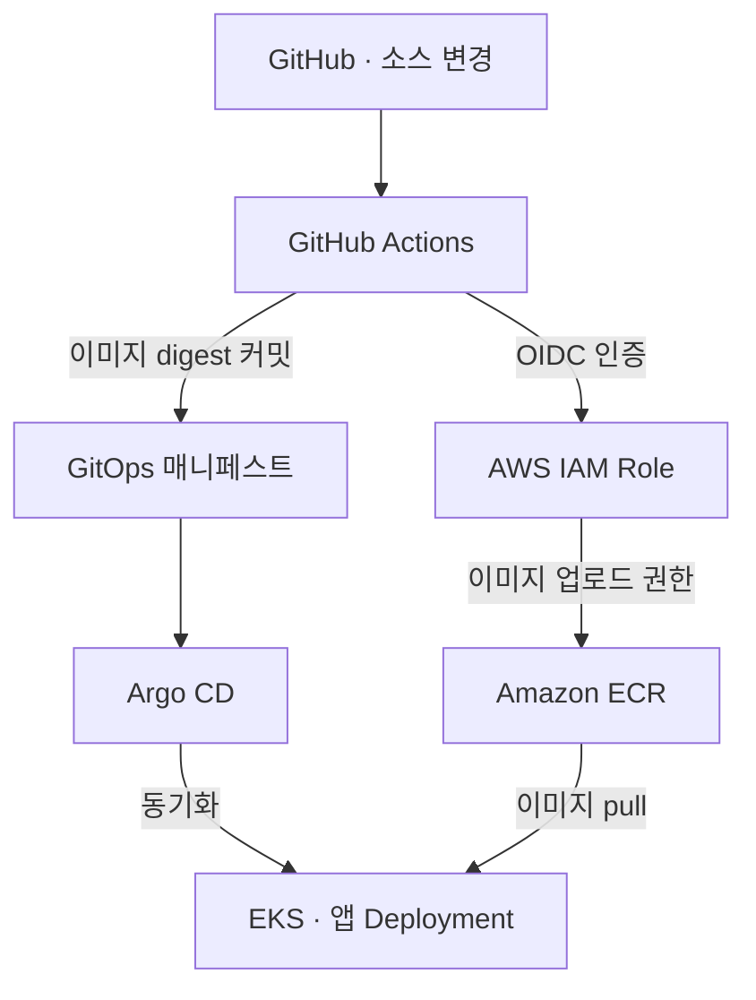
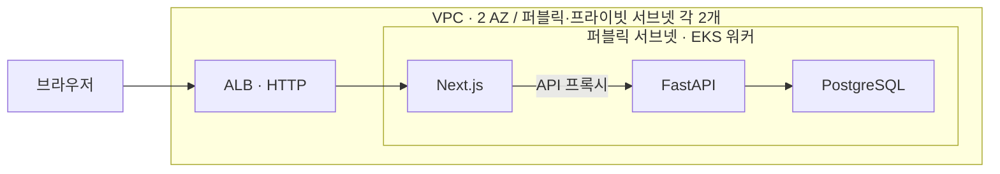

# Movie Review DevOps

**Terraform으로 AWS 인프라를 구성하고, GitOps 배포·Kubernetes 운영 자동화·장애 대응을 검증한 개인 DevOps 프로젝트입니다.**

공동 개발한 [영화 리뷰 분석 애플리케이션](https://github.com/JustJaebbang/capstone)을 배포 대상으로 사용했습니다. 이 저장소에서는 제가 수행한 인프라 구성, CI/CD, 접근 제어, 모니터링 및 복구 실습을 기록합니다. FastAPI·Next.js·PostgreSQL 소스는 이미지 빌드와 배포 재현을 위해 함께 보관합니다.

> **현재 상태 · 2026-10-10:** 계획한 실습과 검증을 완료하고 EKS 및 실습 EC2·EBS를 정리했습니다. 상시 데모 대신 설정 코드·실행 로그·캡처를 제공합니다.

[핵심 성과](#핵심-성과) · [아키텍처](#아키텍처) · [장애 대응](#대표-장애-대응) · [재현 방법](#재현-방법) · [상세 문서](#상세-문서)

## 개인 프로젝트 구현 범위

- **인프라:** Terraform으로 VPC·서브넷·ECR·EKS와 IAM 구성, 관리자 IP 기반 EKS API 접근 제한.
- **배포:** Docker 이미지 구성·개선, GitHub Actions OIDC 인증, ECR 업로드 및 Argo CD GitOps 배포.
- **운영:** HPA·Cluster Autoscaler, Prometheus·Grafana, 장애 진단·복구 및 실습 리소스 정리.
- **플랫폼 실습:** 로컬 Rancher·cert-manager 운영, Python 기반 팀별 Namespace·Quota·RBAC 자동화.

캡스톤 프로젝트에서는 클라우드 배포를 진행하지 않았으며, 이 저장소의 인프라, 배포, 운영 구성과 검증은 공동개발 앱을 대상으로 별도로 수행한 개인 작업입니다. 앱 기능·분석 로직은 공동 저장소에서 설명합니다.

## 핵심 성과

| 검증 항목 | 확인한 결과 | 근거 |
|---|---|---|
| 인프라·배포 | EKS 생성, DB 마이그레이션·앱 Ready, ALB 경유 HTTP 200 | [EKS 기록](k8s/eks-demo/README.md) |
| CI/CD·인증 | OIDC Role 인증, ECR 이미지 업로드, GitOps digest 갱신·Argo CD 동기화 | [OIDC](docs/github-actions-oidc.md) · [배포 기록](docs/verification.md) |
| Pod 확장 | CPU 부하에 따른 HPA의 backend Pod **1 → 2 → 1** | [HPA 기록](k8s/eks-demo/README.md) |
| 노드 확장 | CPU requests 부족으로 Pending 발생 후 EKS 노드 **1 → 2 → 1** 자동 확장·축소 | [Autoscaler](docs/cluster-autoscaler.md) |
| 장애 복구 | 로컬 워커 중지 후 정상 워커에 대체 Pod 생성, HTTP 요청 영향 측정 | [노드 복구](docs/node-recovery.md) |
| 관측·경고 | 자원 지표 수집, CPU 경고 **Firing → Inactive** | [모니터링](k8s/monitoring/README.md) |
| 팀 환경 | Namespace·Quota·RBAC 반복 적용, 타 팀 접근·할당량 초과 차단 | [자동화 기록](docs/team-environment-automation.md) |
| Rancher·CRD | 개발자 권한 검증, 인증서 Ready 확인 및 잘못된 Issuer 참조 복구 | [Rancher 기록](docs/rancher-crd-rbac.md) · [개발자 배포](docs/team-environment-automation.md) |

**환경 구분:** AWS EKS 실습과 로컬 Docker·k3d 실습은 별도로 수행했습니다. HPA와 노드 자동 확장도 각각 검증했으며, 모든 구성요소를 동시에 실행한 통합 운영 환경을 의미하지 않습니다.

## 아키텍처

### CI/CD와 GitOps



GitHub Actions의 장기 액세스 키 인증을 OIDC로 전환하고, main 브랜치의 subject와 audience를 제한했습니다. 배포 이미지는 digest로 고정합니다. Argo CD는 `k8s/gitops/movie-app`의 Deployment·Service·ConfigMap을 관리하며, DB·Secret·마이그레이션 Job·ALB는 별도로 구성합니다.

### AWS 배포 환경



- **네트워크:** 서울 리전, VPC `10.0.0.0/16`, NAT Gateway 없음. EKS 제어 평면 연결 ENI는 프라이빗 서브넷에 배치하고, API는 프라이빗 접근 및 관리자 공인 IPv4 `/32` 접근을 허용했습니다.
- **워커:** `t3.large`, 루트 디스크 20GiB. 앱 배포는 1대, 별도 Autoscaler 실습은 최소 1대·최대 2대로 검증했습니다.
- **저장소:** PostgreSQL·모니터링 데이터는 실습용 임시 저장소입니다. 다중 AZ 앱 고가용성 구성은 아닙니다.

로컬 플랫폼 실습은 별도의 **k3d + Rancher** 환경에서 수행했습니다. 팀별 접근 제어·자원 할당량·인증서 CRD와 워커 장애 복구를 검증했으며, Rancher에 외부 EKS를 등록한 구성은 아닙니다.

## 대표 장애 대응

### 대형 이미지로 인한 노드 DiskPressure

| 단계 | 수행 내용 |
|---|---|
| 증상 | backend 롤아웃 지연, 일부 Pod의 `ContainerStatusUnknown`, 노드 `DiskPressure=True` |
| 조사 | 20GiB 노드의 디스크와 이미지 의존성 확인. 백엔드 이미지에 CUDA·NVIDIA·Triton 패키지 포함 |
| 조치 | GitOps 이미지를 이전 digest로 롤백하고 CPU 전용 PyTorch로 변경, 빌드 캐시·패키지 정리 |
| 결과 | CPU 이미지의 정상 롤아웃, CPU 빌드 및 `DiskPressure=False` 확인 |

기존 ECR 표시 크기는 약 3.63GB, 개선 이미지의 로컬 크기는 약 0.97GiB였습니다. 측정 기준이 달라 두 수치로 감소율을 계산하지 않았습니다. [진단·조치 상세](docs/troubleshooting-disk-pressure.md)

### 워커 장애 시 요청 영향과 복구 관측

로컬 k3d 워커 2개에 웹 Pod를 분산한 뒤 한 워커를 강제 중지했습니다. **613회 요청 중 12회 실패**를 관측했고, 정상 워커에 대체 Pod가 생성됐습니다. 노드 중지 완료부터 대체 Pod 최초 응답까지 **5분 46초**가 걸렸습니다. 실패 사이에도 성공 요청이 있었으므로 이 시간을 연속 서비스 중단 시간으로 해석하지 않습니다. [원본 로그·측정 한계](docs/node-recovery.md)

## 재현 방법

저장소 루트에서 클러스터 없이 사전 점검할 수 있습니다.

```bash
bash scripts/infra/preflight.sh
python3 scripts/infra/bootstrap-app.py
bash scripts/infra/install-monitoring.sh --check
```

기본 점검은 AWS·Kubernetes API에 접속하지 않으며, 모니터링 검사는 인터넷에서 Helm 차트를 내려받습니다. 실제 배포는 **Terraform 계획 검토 → EKS 생성 → 앱·관측 도구 설치 → 검증 → 삭제** 순서입니다. 실행 명령과 제약은 [배포 스크립트 안내](scripts/infra/README.md)를 참고하세요.

2026-10-05 새 EKS에서 앱·모니터링 스크립트의 최초 설치 경로를 검증했습니다. 기존 DB·Secret이 있는 상태의 재실행과 중간 실패 복구는 미검증입니다. 스크립트는 ALB·Argo CD 설치를 포함하지 않습니다.

## 상세 문서

| 문서 | 내용 |
|---|---|
| [검증 캡처](docs/verification.md) | 배포·접속·운영 실습 증거 |
| [OIDC 전환](docs/github-actions-oidc.md) | 신뢰 정책, Role 인증 및 CI 실행 결과 |
| [노드 자동 확장](docs/cluster-autoscaler.md) | 설정, 확장·축소 시각 및 ASG 활동 |
| [노드 장애 복구](docs/node-recovery.md) | 로컬 장애 주입과 HTTP 관측 결과 |
| [팀 환경 자동화](docs/team-environment-automation.md) | Python 자동화, RBAC·Quota 및 개발자 배포 |
| [Rancher·CRD](docs/rancher-crd-rbac.md) | 관리 UI, 인증서와 권한 검증 |
| [모니터링](k8s/monitoring/README.md) | Prometheus·Grafana 및 CPU 경고 |
| [재배포 검증](docs/redeployment-verification.md) | 새 EKS에서 최초 설치 경로 확인 |

구현 코드: [Terraform](infra/terraform/) · [CI 워크플로](.github/workflows/ci.yml) · [GitOps](k8s/gitops/movie-app/) · [운영 스크립트](scripts/infra/)

## 검증 범위와 비용 관리

- **확장·복구:** EKS의 HPA와 Cluster Autoscaler는 별도 실험입니다. HPA부터 노드 확장까지의 통합 부하 시험, EKS 앱의 노드 장애 복구·무중단 배포·고가용성은 미검증입니다.
- **데이터·성능:** DB·모니터링 데이터의 영속화·백업 복구, 실제 트래픽 성능, EKS에서 리뷰 수집부터 LLM 분석까지의 전체 파이프라인은 미검증입니다.
- **플랫폼:** 팀 간 네트워크 격리, 사용자 정의 CRD·컨트롤러 개발, 인증서 자동 갱신과 외부 알림은 검증하지 않았습니다.
- **비용:** 필요한 실습 시간에만 실행 리소스를 생성하고 종료 후 삭제합니다. 2026-10-10 EKS 목록이 비어 있고 실습 EC2 2대가 종료됐으며 서울 리전 EBS가 없음을 확인했습니다. 보존한 ECR 이미지에는 저장 비용이 남을 수 있습니다.

종료 점검은 `bash scripts/infra/check-cleanup.sh`로 수행합니다. 조회 범위는 서울 리전의 지정 리소스이며 다른 리전·서비스나 청구액 전체를 확인하는 검사는 아닙니다. Secret 값은 Git에 저장하지 않습니다.
