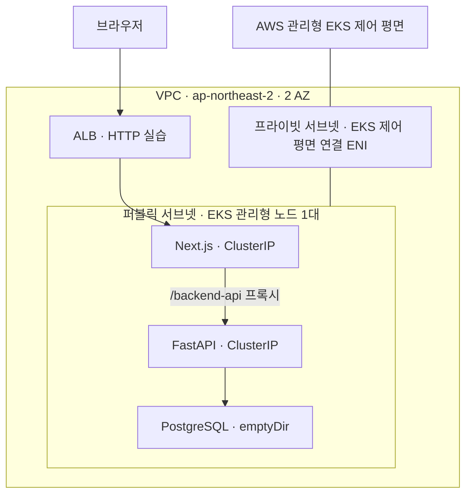
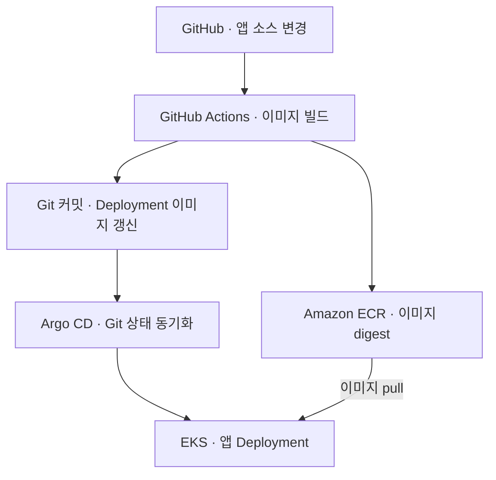

# Movie Review DevOps

영화 리뷰 분석 캡스톤 애플리케이션을 AWS EKS에 배포하고, Terraform 기반 인프라 관리부터 GitOps 자동 배포, 모니터링 및 장애 대응까지 실습한 프로젝트입니다.

FastAPI·Next.js·PostgreSQL 애플리케이션을 배포 대상으로 사용했습니다. 이 저장소에서는 클라우드 환경 구성, 배포 재현성, 관측 및 복구 과정을 중심으로 기록합니다.

> **상태 — 2026-10-05:** 단기 실습 후 EKS 및 주요 실행 리소스를 삭제했습니다. 상시 접속 가능한 데모는 제공하지 않습니다. 2026-10-05 새 EKS에서 앱·모니터링 배포 스크립트의 최초 설치 경로를 검증했습니다. 재실행 및 중간 실패 복구 경로는 미검증입니다.

## 주요 검증 결과

| 영역 | 수행 내용 | 확인한 결과 |
|---|---|---|
| IaC | Terraform으로 VPC·서브넷·ECR·EKS 구성 | 클러스터 생성, 노드 Ready 및 선택한 리소스 삭제 |
| 앱 배포 | ECR digest 고정, DB와 앱 순차 배포 | Alembic Job 완료, DB 테이블 9개, 앱 Ready 및 API·화면 접속 |
| 외부 접속 | Pod Identity 기반 AWS Load Balancer Controller와 ALB | ALB 경유 화면 및 `/backend-api/movies` HTTP 200 응답 |
| GitOps | GitHub Actions → ECR → 배포 파일 갱신 → Argo CD | 이미지 갱신 커밋 생성과 클러스터 동기화·롤아웃 |
| 복구 | backend Pod 삭제 | 새 Pod 자동 생성 및 약 30초 후 Ready |
| 확장·축소 | Metrics Server와 CPU 기반 HPA | 인위적 부하에 따른 backend Pod 1 → 2 → 1 |
| 장애 대응 | 노드 DiskPressure 발생 후 롤백·이미지 개선 | CPU 전용 이미지 배포 후 정상 롤아웃과 DiskPressure=False |
| 모니터링 | Prometheus·Grafana | 노드·Pod 자원 지표 및 CPU 부하 증가·감소 확인 |
| 경고 | PrometheusRule CPU 경고 조건 설정 | 부하 중 Firing, 부하 종료 후 Inactive 확인 |
| 종료 확인 | AWS CLI 조회 자동화 | 서울 리전의 조회 대상 6개 리소스 항목이 모두 0개임을 확인 |

위 항목은 여러 실습 세션에서 검증했습니다. 모든 구성요소를 동시에 실행한 단일 운영 환경을 의미하지 않습니다. 10월 4일 모니터링 실습에는 Argo CD와 HPA를 설치하지 않았습니다.

## Rancher 운영과 CRD·RBAC 실습

2026-10-07~08 Mac의 Docker·k3d에서 수행한 별도 로컬 실습입니다. 이를 위해 AWS 리소스를 새로 생성하지 않았습니다.

| 영역 | 검증 결과 |
|---|---|
| Rancher 운영 | Helm 설치, local 클러스터 관리 및 UI 접속 |
| 관리 서버 복구 | 실수로 replicas=0이 된 Deployment를 kubectl로 1로 복구 |
| cert-manager CRD 활용 | Issuer·Certificate 생성, 인증서 Ready 및 TLS Secret 확인 |
| 인증서 오류 대응 | 존재하지 않는 Issuer 참조를 진단하고 issuerRef 수정으로 복구 |
| 프로젝트 RBAC | Read-only 계정의 ConfigMap 조회 허용 및 API patch 요청 Forbidden 확인 |

외부 EKS 등록, 사용자 정의 CRD·컨트롤러 개발, 인증서 자동 갱신 및 고가용성은 검증 범위에 포함하지 않습니다.

[실습 절차 및 검증 결과](docs/rancher-crd-rbac.md) · [실습 YAML](k8s/rancher-lab/)

## 팀별 Kubernetes 기본 환경 자동화

Python 스크립트로 팀별 Namespace·ResourceQuota·LimitRange·ServiceAccount·RBAC를 생성했습니다. 로컬 k3d에서 반복 적용 시 unchanged, 자기 팀 ConfigMap 관리 허용, 다른 팀 조회 거부, 할당량 초과 차단과 삭제 후 재생성을 검증했습니다.

서버 dry-run으로 컨테이너 기본 자원값 적용과 CPU requests 상한 초과 거부도 확인했습니다. 자동화 범위는 관리자용 기본 환경 구성입니다. 후속 실습에서는 Rancher 프로젝트와 개발자 계정을 수동 연결하고, 해당 계정으로 샘플 앱 배포·컨테이너 내부 HTTP 응답·다른 팀 조회 및 할당량 수정 거부를 확인했습니다. 네트워크 격리는 검증하지 않았습니다.

[구현 및 검증 기록](docs/team-environment-automation.md)

## 아키텍처

### 애플리케이션 접속과 네트워크



- VPC CIDR: `10.0.0.0/16`, 퍼블릭·프라이빗 서브넷 각 2개, NAT Gateway 없음.
- EKS API는 프라이빗 접근을 활성화하고 퍼블릭 접근은 관리자 IPv4 `/32`로 제한했습니다.
- 노드는 퍼블릭 서브넷의 `t3.large` 1대이며 루트 디스크는 20GiB입니다.
- ALB 실습에서는 프론트엔드로 요청을 전달하고 Next.js가 백엔드 API를 프록시했습니다.
- ALB를 사용하지 않는 실습에서는 로컬 포트포워딩으로 접속했습니다.
- 2개 AZ에 서브넷을 구성했지만 실제 워커 노드는 1대이므로 다중 AZ 애플리케이션 고가용성 구성이 아닙니다.

### CI/CD와 GitOps



Argo CD는 `k8s/gitops/movie-app`의 Deployment·Service·ConfigMap을 관리합니다. DB·Secret·마이그레이션 Job과 ALB는 이 경로에 포함하지 않았습니다. 이미지 배포에는 변경 가능한 `latest` 대신 digest를 사용했습니다.

## 기술 및 설정

| 구분 | 사용 기술·실습 설정 |
|---|---|
| 애플리케이션 | FastAPI, Next.js, PostgreSQL 16, SQLAlchemy, Alembic |
| 인프라 | Terraform, AWS VPC, ECR, EKS 1.35, EC2 |
| 컨테이너 | Docker, Linux amd64 이미지, CPU 전용 PyTorch |
| 배포 | GitHub Actions, Argo CD, Helm |
| 접속 | AWS Load Balancer Controller, EKS Pod Identity, ALB |
| 확장 | Metrics Server v0.9.0, HPA |
| 관측 | kube-prometheus-stack 91.9.0, Prometheus, Grafana, PrometheusRule |

## 장애 대응: 대형 이미지와 노드 디스크 부족

**증상:** 이미지 갱신 후 backend 롤아웃이 지연되고 일부 Pod에 `ContainerStatusUnknown`이 표시됐습니다. 노드에서 `DiskPressure=True`를 확인했습니다.

**조사:** 노드 파일시스템·이미지 저장 공간, Pod 상태와 의존성을 확인했습니다. 기존 백엔드 이미지는 ECR 표시 크기 약 3.63GB였고, Linux용 PyTorch 의존성에 CUDA·NVIDIA 패키지와 Triton이 포함돼 있었습니다. 20GiB 노드에서 대형 이미지의 저장·압축 해제가 디스크 부담을 키웠습니다.

**조치:** GitOps 배포 이미지를 이전 digest로 되돌린 뒤 Linux 환경에서 CPU 전용 PyTorch 인덱스를 사용하도록 변경했습니다. 이미지 빌드 시 uv 캐시를 남기지 않고 패키지 목록도 정리했습니다.

**결과:** 로컬 CPU 이미지 크기 약 0.97GiB, CUDA 빌드 없음, GPU 관련 패키지 없음 및 sentence-transformers import 성공을 확인했습니다. 이후 CI로 생성한 CPU 이미지를 EKS에 배포하고 PyTorch CPU 빌드, 정상 롤아웃, `DiskPressure=False`를 확인했습니다.

> ECR 이미지 크기와 로컬 이미지 크기는 측정 기준이 달라 두 수치로 감소율을 계산하지 않았습니다. 이미지 개선 후 장기 운영 안정성이나 실제 분석 처리 성능까지 검증한 것은 아닙니다.

## 모니터링과 경고 검증

- Prometheus 수집·평가 주기: 30초.
- Prometheus 보관 설정: 6시간, retentionSize 512MB, emptyDir sizeLimit 2GiB.
- Grafana와 Prometheus는 ClusterIP와 포트포워딩으로 접속했습니다.
- 120초간 인위적인 CPU 부하를 발생시켜 Grafana에서 증가·감소를 관찰했습니다.
- `MovieBackendHighCPU`: 최근 2분 평균 backend CPU 사용량이 0.2코어를 초과한 상태로 1분 유지하면 경고합니다.
- 별도의 240초 부하 실습에서 Firing과 종료 후 Inactive를 확인했습니다.
- Alertmanager는 비활성화했으며 이메일·Slack 알림은 검증하지 않았습니다.

상세 설정과 명령은 [모니터링 검증 기록](k8s/monitoring/README.md)에 있습니다.

## 재현 방법과 검증 상태

먼저 저장소 루트에서 클러스터 없이 점검할 수 있습니다.

```bash
bash scripts/infra/preflight.sh
python3 scripts/infra/bootstrap-app.py
bash scripts/infra/install-monitoring.sh --check
```

모니터링 검사는 인터넷에서 Helm 차트를 내려받습니다. 위 기본 점검은 AWS·Kubernetes API에 접속하지 않으며 ECR 이미지 존재 여부나 AWS 권한까지 검증하지는 않습니다.

실제 재배포는 다음 순서로 진행합니다.

1. Terraform 계획 검토 후 EKS와 노드를 생성합니다. 이때부터 실행 리소스 비용이 발생합니다.
2. kubeconfig와 노드 Ready를 확인합니다.
3. 앱 스크립트의 `--apply` 모드로 DB·마이그레이션·앱을 준비합니다.
4. 모니터링 스크립트의 `--apply` 모드로 관측 도구와 경고 규칙을 설치합니다.
5. API·화면·수집 대상·경고 규칙을 검증하고 증거를 확보합니다.
6. 삭제 계획 검토·적용 후 잔존 리소스를 조회합니다.

**2026-10-05 새 EKS에서 자동화 스크립트의 최초 설치 경로를 검증했습니다.** 기존 DB·Secret이 있는 상태의 재실행, Argo CD 충돌 차단 및 중간 실패 복구는 검증하지 않았습니다. 상세 근거는 [재배포 검증 기록](docs/redeployment-verification.md)에 있습니다. 앱 스크립트는 Argo CD가 해당 네임스페이스를 관리 중이면 중단하며, ALB·Argo CD 설치를 포함하지 않습니다.

| 문서·경로 | 내용 |
|---|---|
| [배포 스크립트 사용법](scripts/infra/README.md) | 로컬 점검, 실행 모드, 재실행 제약 |
| [EKS 실습 기록](k8s/eks-demo/README.md) | 수동 배포, HPA, GitOps 복구 등 검증 기록 |
| [모니터링 기록](k8s/monitoring/README.md) | 자원 관측과 CPU 경고 검증 |
| [Terraform](infra/terraform/) | 인프라 정의 |
| [CI 워크플로](.github/workflows/ci.yml) | 이미지 빌드 및 GitOps 이미지 갱신 |
| [GitOps 리소스](k8s/gitops/movie-app/) | Argo CD가 관리하는 앱 구성 |
| [기존 앱 설계 원문](docs/application-design-original.md) | 초기·후기 설계와 KPI 목표; 현재 구현·실측 결과와 구분 |

## 비용 관리와 종료 확인

상시 운영 대신 필요한 실습 시간에만 인프라를 생성하고 종료 후 삭제합니다. 포트포워딩이나 노트북을 종료하는 것만으로 AWS 리소스가 삭제되지는 않습니다.

```bash
bash scripts/infra/check-cleanup.sh
```

2026-10-05 서울 리전에서 EKS, 종료되지 않은 EC2, EBS, ALB/NLB/GWLB, 조회 대상 NAT Gateway, Elastic IP가 모두 0개임을 확인했습니다. 이 검사는 다른 리전·서비스나 청구액 전체를 확인하지 않습니다. 보존한 ECR 이미지에는 저장 비용이 남을 수 있습니다.

## 실습 범위와 제한

- 단일 노드 구성으로 노드 장애 복구·무중단·고가용성을 보장하지 않습니다.
- PostgreSQL과 모니터링 데이터는 임시 저장소를 사용합니다. 관련 Pod 삭제 시 데이터가 사라질 수 있으며 백업·복구는 미검증입니다.
- HPA는 Pod 수를 조절했으며 노드 자동 확장은 검증하지 않았습니다.
- CPU 부하는 인위적인 실습이며 실제 사용자 트래픽 성능 시험이 아닙니다.
- EKS에서 실제 리뷰 수집부터 LLM 분석까지 전체 파이프라인은 검증하지 않았습니다. 앱 설계 문서의 정확도·응답 시간 KPI는 달성 결과가 아닙니다.
- GitHub Actions의 AWS 인증을 OIDC 기반 IAM Role로 전환했습니다. main 브랜치의 OIDC subject와 audience를 제한하고, backend·frontend ECR 저장소에 필요한 이미지 접근·업로드 권한을 부여했습니다. Role 인증·이미지 빌드 및 업로드·GitOps digest 갱신을 검증했습니다.
- Secret 값은 Git에 저장하지 않으며, 공개 캡처에서도 비밀번호·토큰을 제외합니다.

## 완료한 후속 검증

- 2026-10-05 새 EKS에서 앱·모니터링 배포 스크립트의 최초 설치 경로를 검증했습니다.
- 마이그레이션, 앱 rollout, Prometheus 지표 수집 및 경고 규칙 로드를 확인했습니다.
- 검증 후 EKS 관련 리소스를 삭제하고 서울 리전의 지정 6개 리소스 항목이 모두 0개임을 확인했습니다.
- 실습 캡처, 장애 대응 과정, 재배포 검증 결과를 문서에 연결했습니다.

## 선택 확장 과제

- [완료] GitHub Actions AWS 인증을 OIDC로 전환 — [검증 기록](docs/github-actions-oidc.md)
- PostgreSQL 영속화 및 백업·복구 검증
- 앱 요청 지표, HTTP 부하 시험 및 외부 알림 확장

위 항목은 현재 완료한 실습 범위 이후의 개선 과제입니다.

## 검증 캡처

[실습 캡처 및 검증 기록](docs/verification.md)

## 장애 해결 기록

[DiskPressure 장애 대응 및 CPU 이미지 개선](docs/troubleshooting-disk-pressure.md)

## 재배포 자동화 검증

[실제 EKS 재배포 자동화 검증](docs/redeployment-verification.md)
