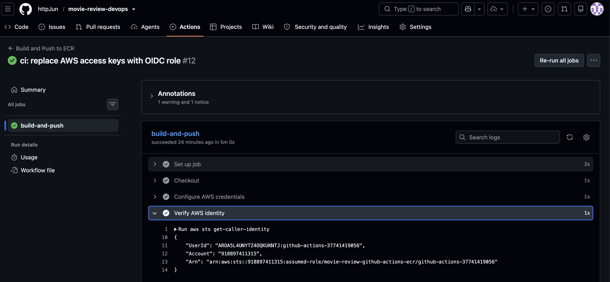
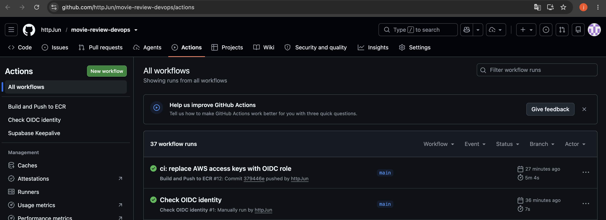

# GitHub Actions AWS OIDC 인증 전환

## 목적

GitHub Actions에 저장된 장기 AWS 액세스 키를 사용하는 방식에서,
OIDC로 IAM Role의 임시 자격 증명을 발급받는 방식으로 전환했다.

## 구성

- Terraform: `infra/terraform/github-oidc.tf`
- 워크플로: `.github/workflows/ci.yml`
- IAM Role: `movie-review-github-actions-ecr`
- Audience: `sts.amazonaws.com`
- 허용 subject: `repo:httpJun@105117336/movie-review-devops@1395655537:ref:refs/heads/main`
- ECR 이미지 접근·업로드 권한: movie-review-backend, movie-review-frontend
- ECR 로그인에 필요한 GetAuthorizationToken은 Resource "*" 사용
- GitHub 권한: id-token: write, contents: write
- contents: write는 GitOps 이미지 digest 커밋·푸시에 사용

## 검증 결과

2026-10-08, Actions 실행 37741419056에서 다음을 확인했다.

1. AWS STS 호출 결과 assumed-role/movie-review-github-actions-ecr 확인
2. backend 이미지 빌드 및 ECR 업로드 성공
3. frontend 이미지 빌드 및 ECR 업로드 성공
4. GitOps Deployment의 이미지 digest 갱신 및 커밋·푸시 성공
5. 전체 워크플로 성공

워크플로의 AWS 인증 단계에서 액세스 키 Secrets 참조를 제거했다.
GitHub Secrets 삭제 여부와 로컬 AWS CLI의 키 사용 여부는 별도로 관리한다.

## 검증 범위

허용된 main 브랜치의 정상 인증과 이미지 배포 파이프라인을 검증했다.
다른 브랜치·저장소의 Role 사용 거부는 별도 실행으로 검증하지 않았다.
이번 작업으로 EKS 클러스터나 EC2 노드를 생성하지 않았다.

## 관련 파일

- [OIDC IAM 구성](../infra/terraform/github-oidc.tf)
- [CI 워크플로](../.github/workflows/ci.yml)
- [OIDC 식별값 확인 워크플로](../.github/workflows/oidc-check.yml)

## 검증 캡처

