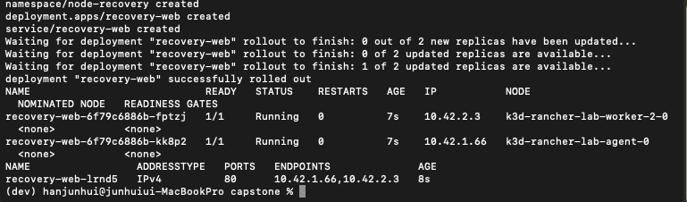
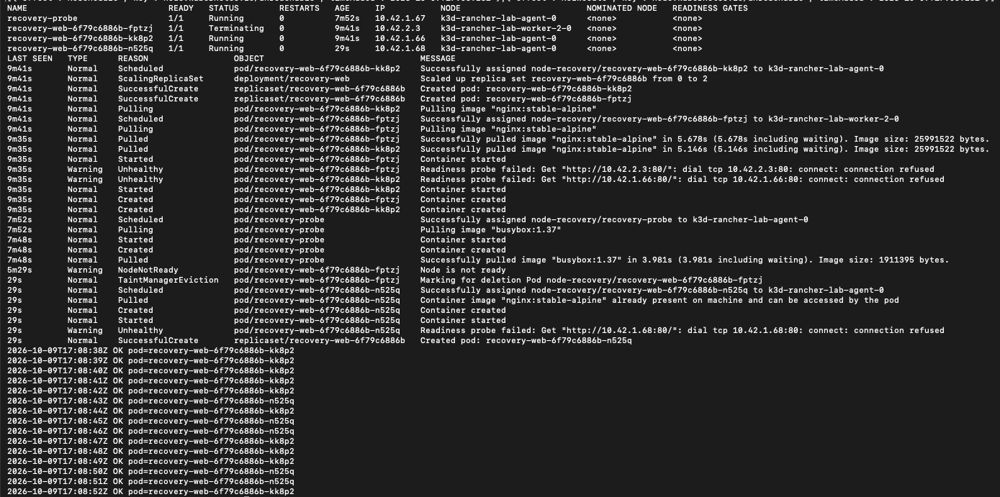

# 로컬 다중 노드 장애·복구 검증

## 목적과 환경

워커 중단 시 Service 요청의 영향과 Deployment 대체 Pod 생성을 확인했다.

- 실습일: 2026-10-10 KST (로그는 2026-10-09 UTC)
- 클러스터: k3d rancher-lab
- Kubernetes: v1.36.4+k3s1
- 구성: 서버 1개, 워커 2개
- 샘플: nginx 웹 Pod 2개와 ClusterIP Service
- 관측: 기존 워커의 별도 Pod에서 Service로 반복 HTTP 요청
- 샘플 Pod는 recovery-lab=true 라벨의 워커에만 배치
- topologySpreadConstraints의 ScheduleAnyway로 분산을 우선하되,
  장애 시 남은 워커에 두 Pod가 함께 배치되는 것을 허용
- not-ready/unreachable 기본 tolerationSeconds 300 유지

## 장애 재현

장애 전 웹 Pod가 두 워커에 하나씩 배치된 것을 확인했다.
새 워커 컨테이너를 다음 명령으로 강제 중지했다.

    docker stop --time 0 k3d-rancher-lab-worker-2-0

Pod 수동 삭제나 Deployment 재시작 없이 복구를 관찰했다.

## 검증 결과

모든 시각은 UTC이며 HTTP 로그 시각은 요청 시작 시각이다.

| 항목 | 결과 |
|---|---|
| 관측 구간 | 17:02:15~17:12:54 |
| 요청 수 | 613회 |
| 실패 수 | 12회 |
| 노드 중지 요청 / 완료 | 17:02:38 / 17:02:39 |
| unreachable taint 적용 | 17:03:23 |
| 첫 실패 / 마지막 실패 | 17:02:39 / 17:03:21 |
| 마지막 실패 이후 첫 성공 | 17:03:24 |
| 대체 Pod 최초 성공 응답 | 17:08:25 |
| 중지 완료부터 대체 Pod 최초 응답까지 | 5분 46초 |

장애 워커의 기존 Pod fptzj에 TaintManagerEviction 이벤트가 발생했고,
대체 Pod n525q가 정상 워커 agent-0에 생성됐다.
기존 Pod kk8p2와 대체 Pod n525q 모두 Service를 통해 응답했다.

노드를 다시 시작한 뒤 세 노드 모두 Ready인 것을 확인했다.
실행 중인 웹 Pod 두 개는 기존 워커에 유지됐다.

## 해석과 한계

- 남은 Pod를 통한 요청 처리가 먼저 안정됐고 이후 복제본 수가 회복됐다.
- 실패 구간에도 성공 요청이 있었으므로 42초 연속 중단으로 해석하지 않는다.
- 5분 46초는 서비스 중단 시간이 아닌 대체 Pod 최초 응답까지의 시간이다.
- 무중단 검증이 아니며 전체 관측 구간에서 12회의 타임아웃이 발생했다.
- HTTP 표본 관측이며 정확한 Ready 전환 시각이나 장기 SLA 측정이 아니다.
- 클러스터 내부 Service 경유 검증으로 외부 ALB·Ingress는 포함하지 않는다.
- 한 Mac의 Docker 환경이므로 물리 호스트·AWS AZ 장애 검증은 아니다.
- 데이터베이스 영속성과 컨트롤 플레인 고가용성은 검증하지 않았다.
- 이미지 태그가 가변이므로 향후 실행 시 이미지 버전이 달라질 수 있다.

## 재현 파일과 증거

- [샘플 Deployment·Service](../k8s/node-recovery/demo.yaml)
- [HTTP 관측 Pod](../k8s/node-recovery/probe.yaml)
- [관측 요약](evidence/node-recovery/summary.txt)
- [HTTP 로그](evidence/node-recovery/http-probe.log)
- [상태 변화 기록](evidence/node-recovery/recovery-timeline.log)
- [이벤트](evidence/node-recovery/events.json)

재현 전에 두 워커에 recovery-lab=true 라벨을 설정한다.
probe.yaml은 기존 워커 k3d-rancher-lab-agent-0에서 실행하도록 지정했다.

실습 종료 시 다음 명령으로 클러스터를 중지한다.

    k3d cluster stop rancher-lab

## 검증 캡처

