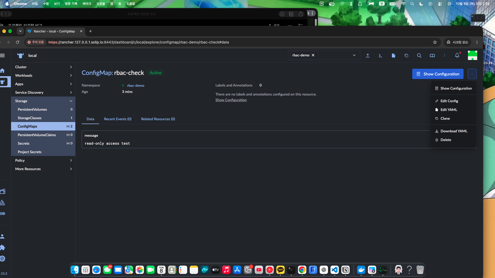
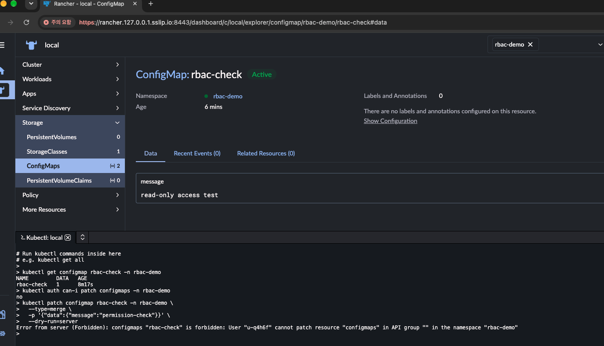

# Rancher · cert-manager CRD · RBAC 실습

## 검증 요약 — 2026-10-07~08 (KST)

기존 AWS EKS 실습과 별도로 Mac의 Docker 및 k3d에서 수행했다.
이번 실습을 위해 AWS 리소스를 새로 생성하지 않았다.

| 영역 | 수행 내용 | 결과 |
|---|---|---|
| Rancher | Helm 설치 및 local 클러스터 관리 | UI 접속, Rancher Pod Ready |
| 운영 복구 | Deployment replicas=0 원인 확인 | replicas=1 복구 후 UI 재접속 |
| CRD 활용 | Issuer·Certificate 생성 | Certificate Ready=True, TLS Secret 생성 |
| 오류 대응 | 존재하지 않는 Issuer 참조 | CertificateRequest에서 Issuer NotFound 확인 |
| 인증서 복구 | issuerRef를 정상 Issuer로 수정 | 인증서 발급 복구 |
| RBAC | 프로젝트 Read-only 사용자 구성 | ConfigMap 조회 성공, patch 요청 Forbidden |

## 환경

- Mac ARM64, RAM 16 GiB, Docker 메모리 약 8 GiB
- k3d v5.9.0, K3s v1.36.4+k3s1
- 클러스터: rancher-lab
- kubectl context: k3d-rancher-lab
- 서버 1개, 에이전트 1개
- Rancher v2.15.2, cert-manager v1.21.2
- Traefik Ingress, 호스트 포트 8080→80 및 8443→443
- UI: https://rancher.127.0.0.1.sslip.io:8443

두 노드는 같은 Docker VM에서 실행되며 고가용성 구성이 아니다.
위 버전은 실습 당시 사용값이며 다른 버전 조합은 검증하지 않았다.

## Rancher 설치와 운영 복구

cert-manager와 Rancher를 Helm으로 설치했다.
Rancher는 cattle-system 네임스페이스에 복제본 1개로 구성했다.
Ingress 클래스는 traefik, TLS source는 rancher를 사용했다.

cert-manager Pod 3개와 Rancher Pod의 Running 상태,
tls-rancher-ingress Certificate의 Ready=True 및 UI 접속을 확인했다.

이후 UI에서 복제본 수를 조작하다 Rancher가 replicas=0으로 변경됐다.
Deployment·ReplicaSet 조회와 Events에서 1→2→1→0 변경을 확인했다.
최초 2→1 조작 당시 나타난 오류 자체의 원인은 확정하지 않았다.

복구 명령:

    kubectl --context k3d-rancher-lab scale deployment rancher -n cattle-system --replicas=1
    kubectl --context k3d-rancher-lab rollout status deployment/rancher -n cattle-system --timeout=180s

복구 후 UI에 다시 접속했다.
Rancher UI 중단 상태에서도 Kubernetes API에 직접 연결한 kubectl로 복구했다.
이후 확장·축소 실습은 관리 도구와 분리된 테스트 리소스로 수행한다.

## cert-manager CRD 활용

cert-manager가 제공하는 CRD를 설치하고 Issuer·Certificate 리소스를 생성했다.
직접 CRD나 컨트롤러를 개발한 실습은 아니다.

저장소 루트에서 정상 구성을 적용한다.

    kubectl --context k3d-rancher-lab apply -f k8s/rancher-lab/certificate-demo.yaml
    kubectl --context k3d-rancher-lab wait --for=condition=Ready certificate/movie-review-demo -n crd-lab --timeout=120s
    kubectl --context k3d-rancher-lab get issuers,certificates,certificaterequests -n crd-lab
    kubectl --context k3d-rancher-lab get secret movie-review-demo-tls -n crd-lab

Issuer와 Certificate의 Ready=True,
CertificateRequest의 Approved=True·Ready=True 및 TLS Secret 생성을 확인했다.
자체 서명 인증서 실습이며 영화 리뷰 앱의 HTTPS에 연결하지 않았다.

## Issuer 참조 오류 재현과 복구

다음 파일은 선택적으로 적용하는 의도적인 실패 시험용이다.
복구한 동일 이름의 Certificate에 다시 적용하면 잘못된 참조로 변경된다.

    kubectl --context k3d-rancher-lab apply -f k8s/rancher-lab/failure-demo/missing-issuer.yaml
    kubectl --context k3d-rancher-lab describe certificate movie-review-error-demo -n crd-lab
    kubectl --context k3d-rancher-lab describe certificaterequest -n crd-lab

CertificateRequest에서 확인한 원인:

    Referenced "Issuer" not found: issuer.cert-manager.io "missing-issuer" not found

요청은 Approved=True였지만 Ready=False였다.
승인은 발급 완료를 의미하지 않는다.
Certificate의 SecretDoesNotExist 메시지에 이어
CertificateRequest 상태를 조사하여 잘못된 Issuer 참조를 확인했다.

복구 명령:

    kubectl --context k3d-rancher-lab patch certificate movie-review-error-demo -n crd-lab --type=merge -p '{"spec":{"issuerRef":{"name":"lab-selfsigned"}}}'
    kubectl --context k3d-rancher-lab wait --for=condition=Ready certificate/movie-review-error-demo -n crd-lab --timeout=120s

정상 Issuer로 변경한 뒤 인증서 발급이 복구됐다.
운영 서비스 장애가 아닌 의도적인 오류 재현 실습이다.

## 프로젝트 RBAC

관리자 계정으로 Rancher UI에서 다음을 구성했다.

1. portfolio-lab 프로젝트 생성
2. 프로젝트 아래 rbac-demo 네임스페이스 생성
3. portfolio-viewer 사용자 생성, 전역 권한 User-Base 선택
4. 프로젝트 멤버에 portfolio-viewer를 Read-only로 추가
5. 기존 admin의 Project Owner 유지

관리자 권한의 Mac 터미널에서 테스트 데이터를 생성한다.

    kubectl --context k3d-rancher-lab apply -f k8s/rancher-lab/rbac-check.yaml

이 YAML은 ConfigMap만 생성한다.
프로젝트·사용자·권한은 위 UI 절차로 별도 설정해야 한다.

시크릿 창에서 portfolio-viewer로 로그인한 뒤 ConfigMap을 조회했다.
View Config·Download YAML은 표시되고 수정·삭제 메뉴는 표시되지 않았다.

viewer로 로그인한 Rancher kubectl Shell에서 다음을 실행했다.
관리자 권한의 Mac 터미널에서 실행한 결과와 구분한다.

    kubectl get configmap rbac-check -n rbac-demo
    kubectl auth can-i patch configmaps -n rbac-demo
    kubectl patch configmap rbac-check -n rbac-demo --type=merge -p '{"data":{"message":"permission-check"}}' --dry-run=server

실제 결과:

- 조회 성공: rbac-check, DATA 1
- 수정 권한 확인: no
- 수정 요청: Error from server (Forbidden)
- 상세: User "u-q4h6f" cannot patch resource "configmaps" in API group "" in the namespace "rbac-demo"

사용자 ID는 실습 환경의 값으로 재구성 시 달라질 수 있다.
server dry-run으로 영구 변경 없이 API의 patch 거부를 확인했다.
생성·삭제 및 다른 네임스페이스 접근은 별도 API 시험을 수행하지 않았다.

## 범위와 제한

- Rancher local 클러스터만 관리했으며 외부 EKS 등록은 검증하지 않았다.
- 인증서 자동 갱신, 운영 CA 연동 및 앱 HTTPS 적용은 검증하지 않았다.
- 관리 서버 고가용성·백업·복원 및 장기 운영은 검증하지 않았다.
- 비밀번호, 토큰, TLS 개인키 및 kubeconfig는 Git에 저장하지 않는다.

## 실습 종료와 재개

Mac 자원 사용을 멈출 때:

    k3d cluster stop rancher-lab

다시 시작할 때:

    k3d cluster start rancher-lab

정지는 삭제와 다르며 로컬 데이터는 디스크에 남는다.
이 명령은 AWS 리소스나 기존 AWS 청구 상태에 영향을 주지 않는다.

## 관련 파일

- [정상 인증서 구성](../k8s/rancher-lab/certificate-demo.yaml)
- [오류 재현 구성](../k8s/rancher-lab/failure-demo/missing-issuer.yaml)
- [RBAC 테스트 데이터](../k8s/rancher-lab/rbac-check.yaml)
- [프로젝트 개요](../README.md)

## RBAC 검증 캡처

viewer 계정에서 ConfigMap 조회가 가능하고 수정·삭제 메뉴가 표시되지 않는 화면.

같은 계정의 Rancher kubectl Shell에서 조회 성공, 수정 권한 no,
patch 요청 Forbidden을 확인한 결과.

