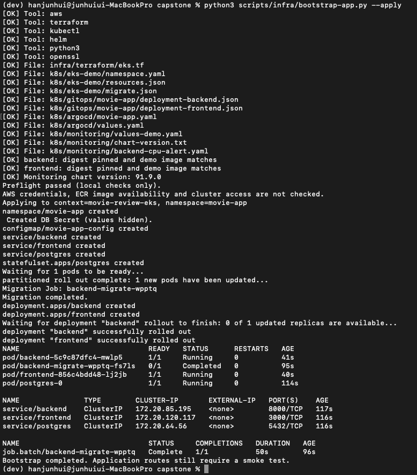
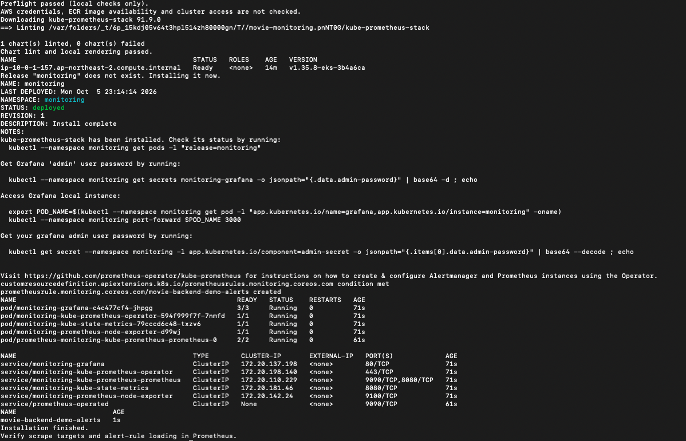
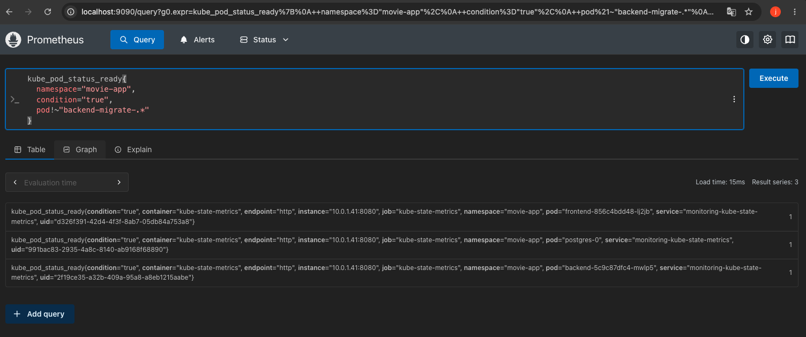
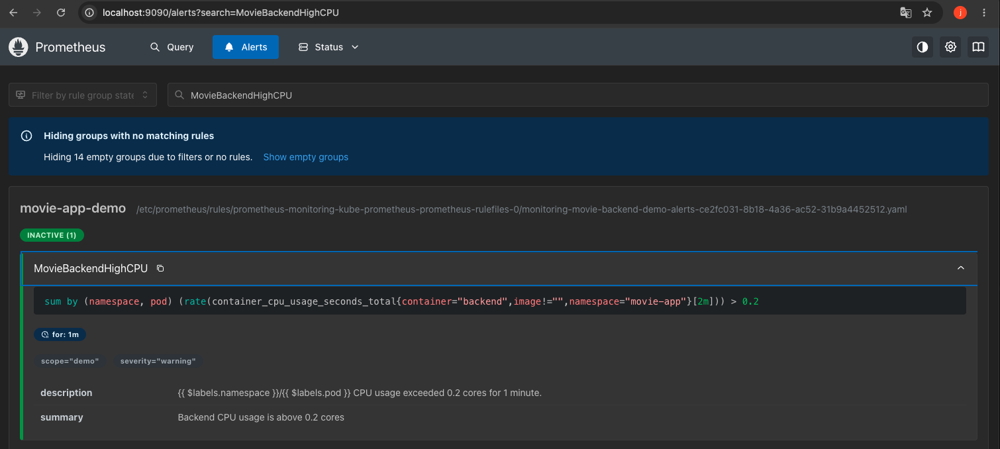
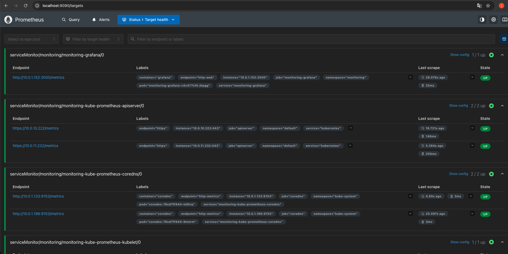
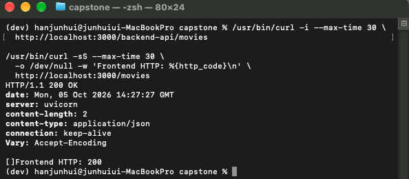
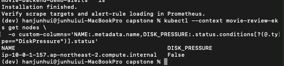

# 새 EKS 재배포 자동화 검증

## 검증 요약 — 2026-10-05 (KST)

기존 VPC·ECR을 재사용하여 EKS와 워커 노드를 새로 생성한 뒤, 앱 및 모니터링 설치 스크립트의 최초 배포 경로를 실제 환경에서 검증했다. 검증 후 EKS 관련 리소스 6개를 삭제하고 서울 리전 잔존 리소스 검사에서 PASS를 확인했다.

| 항목 | 결과 | 근거 |
| --- | --- | --- |
| 앱 자동 설치 | 성공 | bootstrap 완료, DB 마이그레이션 Complete, 앱 rollout 성공 |
| 모니터링 자동 설치 | 성공 | Helm deployed, Pod 모두 Ready, PrometheusRule 생성 |
| Pod 상태 수집 | 성공 | backend·frontend·postgres Ready 지표 각각 1 |
| 경고 규칙 로드 | 성공 | MovieBackendHighCPU가 Inactive로 표시 |
| 수집 대상 | 캡처에 표시된 대상 UP | Grafana·API Server·CoreDNS·kubelet |
| HTTP 응답 | API 200 및 빈 배열, 페이지 200 | curl 캡처; 연결 대상에 관한 주의는 아래 참고 |
| 브라우저 | 정상 접속 보고 | 실행자 확인, 브라우저 화면 캡처는 이 문서에 없음 |
| 노드 디스크 상태 | 정상 | DiskPressure=False |
| 종료 후 검사 | PASS | 서울 리전 지정 6개 항목 모두 0 |

## 환경과 입력

- EKS: `movie-review-eks`, Kubernetes 1.35, 서울 리전
- 워커: t3.large 1대, 디스크 20 GiB
- 모니터링 차트: kube-prometheus-stack 91.9.0
- 앱: `movie-app` / 모니터링: `monitoring`
- PostgreSQL 및 Prometheus 저장소: 임시 저장 구성
- Service: ClusterIP, Ingress·PVC 없음
- 이번 실행에는 Argo CD·HPA·ALB 설치를 포함하지 않음

실행 전 ECR에서 다음 digest의 존재를 확인했다.

```text
backend: sha256:8015ce68c8c0306e059f646edf644dfdd15c5a5ff24134279358f4cf4f4771bd
frontend: sha256:07ed9120ebe6bbc3a30a61a3f648fa5a53e8614654ef07d6c90ed4766bde4c56
```

## 1. 앱 자동 배포

```bash
python3 scripts/infra/bootstrap-app.py --apply
```

Secret 생성, PostgreSQL 준비, 마이그레이션, backend·frontend 배포가 순서대로 완료되었다. 마이그레이션 Job은 Complete 1/1, backend·frontend·postgres는 모두 1/1 Running이며 재시작 횟수는 0이었다. Secret 값은 출력하지 않았다.



## 2. 모니터링 자동 설치

```bash
bash scripts/infra/install-monitoring.sh --apply
```

차트 lint와 렌더링 후 Helm 설치가 완료되었다. Grafana, Operator, kube-state-metrics, node-exporter, Prometheus가 Ready 상태였고 `movie-backend-demo-alerts`가 생성되었다.



캡처에는 Grafana 비밀번호 조회 방법만 포함되며 실제 비밀번호 값은 포함되지 않는다.

## 3. 실제 지표 수집과 규칙 로드

```promql
kube_pod_status_ready{namespace="movie-app",condition="true",pod!~"backend-migrate-.*"}
```

완료된 마이그레이션 Job을 제외한 앱 Pod 세 개가 각각 1로 조회되었다.



경고 규칙 `MovieBackendHighCPU`는 Prometheus에서 Inactive로 표시되었다. 이번에는 규칙 로드만 확인했으며 부하를 주어 Firing을 재검증하지 않았다. 발생·해제 시험은 [이전 검증 기록](verification.md)에 별도로 남아 있다.



Targets 화면에서 보이는 Grafana·API Server·CoreDNS·kubelet 대상은 UP이다. 전체 목록 및 `up == 0` 쿼리 결과는 확보하지 않았으므로 모든 수집 대상이 정상이라는 주장으로 확대하지 않는다.



## 4. HTTP 응답과 화면 접속

캡처에서 `/backend-api/movies`는 HTTP 200과 `[]`를, `/movies`는 HTTP 200을 반환했다. 새 DB의 빈 영화 목록은 이번 기본 접속 검증에서 예상한 결과다. 실행자는 브라우저 화면도 정상 접속했다고 확인했다.



캡처의 주소는 localhost:3000이다. 이 화면만으로 3000번 포트를 소유한 프로세스를 식별할 수는 없다. EKS 접속 증거를 독립적으로 재현하려면 포트포워딩 명령과 같은 포트의 응답을 함께 기록한다. 이 캡처를 외부 ALB 접속 검증으로 사용하지 않는다.

## 5. 노드 상태

설치 후 노드 `ip-10-0-1-157.ap-northeast-2.compute.internal`에서 DiskPressure=False를 확인했다.



## 6. 종료 및 잔존 리소스 확인

검토한 Terraform 삭제 계획을 적용한 결과:

```text
Apply complete! Resources: 0 added, 0 changed, 6 destroyed.
```

이후 `bash scripts/infra/check-cleanup.sh`의 실제 출력:

```text
[OK] EKS clusters: 0
[OK] Non-terminated EC2 instances: 0
[OK] EBS volumes: 0
[OK] ALB/NLB/GWLB: 0
[OK] Non-deleted NAT gateways: 0
[OK] Elastic IP allocations: 0
PASS: all six queried resource categories are empty.
```

검사 범위는 서울 리전의 위 6개 항목이다. ECR 저장 비용, 다른 서비스·리전 및 누적 사용료를 확인한 것은 아니다. VPC·ECR 등 재사용할 기반 리소스는 보존했다.

## 검증 범위와 남은 과제

- 새 클러스터에서 스크립트의 최초 설치 성공 경로를 검증했다.
- 기존 DB·Secret이 있는 상태에서 재실행하는 경로, 미완료 Job 차단, Argo CD 충돌 차단 및 중간 실패 복구는 이번에 시험하지 않았다.
- 기존 DB를 유지하는 코드가 있다는 사실을 백업·복구 검증으로 해석하지 않는다.
- HTTP 기본 응답 확인은 실제 리뷰 수집·임베딩·LLM 분석 파이프라인 검증이 아니다.
- 외부 알림, 데이터 영속성, 고가용성, 실제 사용자 부하 성능은 별도 과제다.
- 이번 이미지에서 CPU 전용 torch 여부를 다시 실행 확인하지 않았다. 과거 CPU 이미지 검증 기록과 구분한다.

## 관련 문서

- [배포 스크립트 사용법](../scripts/infra/README.md)
- [기존 실습 캡처](verification.md)
- [DiskPressure 장애 대응](troubleshooting-disk-pressure.md)
- [포트폴리오 개요](../README.md)
