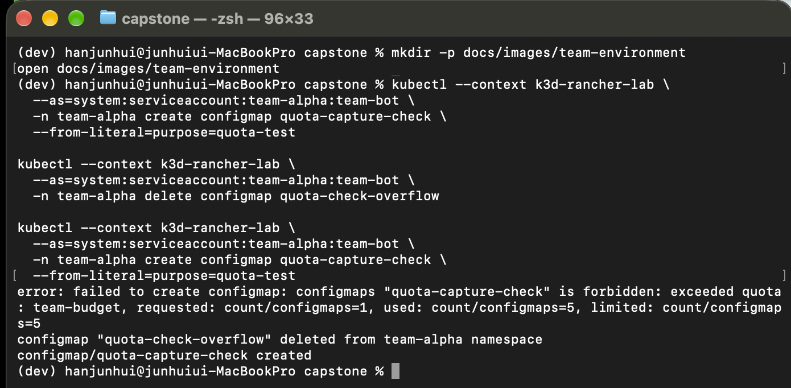
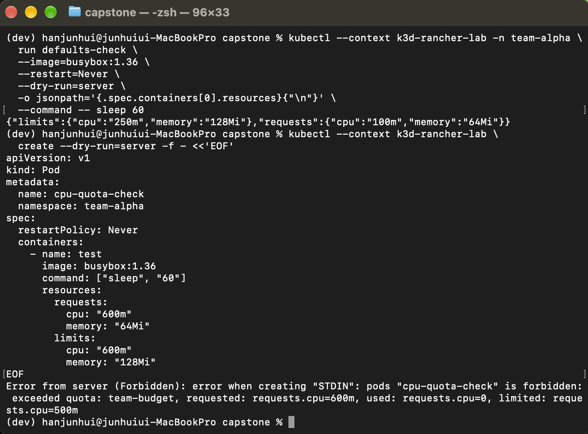
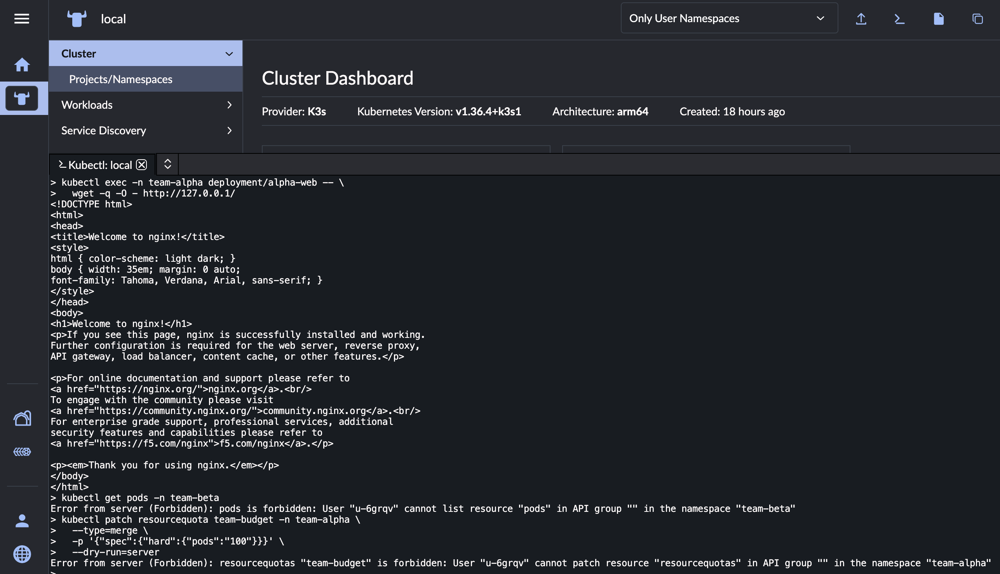

# 팀별 Kubernetes 기본 환경 생성 자동화

## 목적

팀별 Namespace, 자원 할당량, 컨테이너 기본 자원값과 권한을
일관된 설정으로 생성하기 위해 Python 스크립트를 작성했다.

Mac의 k3d-rancher-lab에서 2026-10-08 검증했다.
이번 실습을 위해 AWS 리소스를 생성하지 않았다.

## 사용법

저장소 루트에서 실행한다.

설정 미리보기 — Kubernetes API에 접속하지 않는다:

    python3 scripts/infra/create-team-env.py alpha

실제 적용 — 관리자 권한이 필요하다:

    python3 scripts/infra/create-team-env.py alpha --apply

비교용 팀 생성:

    python3 scripts/infra/create-team-env.py beta --apply

대상 context는 k3d-rancher-lab으로 고정했다.
동일 명령을 재실행하여 모든 대상이 unchanged임을 확인했다.

## 생성하는 리소스

| 리소스 | 설정 |
|---|---|
| Namespace | team-팀이름 |
| ResourceQuota | CPU requests 500m, limits 1코어 |
| ResourceQuota | 메모리 requests 512Mi, limits 1Gi |
| ResourceQuota | Pod 최대 4개, ConfigMap 최대 5개 |
| LimitRange | 컨테이너 기본 requests: CPU 100m, 메모리 64Mi |
| LimitRange | 컨테이너 기본 limits: CPU 250m, 메모리 128Mi |
| ServiceAccount | team-bot, 토큰 자동 마운트 비활성화 |
| Role | 해당 Namespace의 ConfigMap 관리 및 Pod 조회 |
| RoleBinding | team-bot에 위 Role 연결 |

team-bot은 검증용 ServiceAccount로 Rancher 로그인 사용자와 다르다.
Pod·Deployment 생성, Secret 조회, 권한·할당량 변경은 허용하지 않았다.
앱 배포까지 제공하는 완성된 개발 플랫폼은 아니다.

## 검증 결과

| 시험 | 실제 결과 |
|---|---|
| alpha 환경 최초 생성 | 리소스 6개 생성 |
| 같은 명령 재실행 | 모두 unchanged |
| alpha 계정으로 alpha ConfigMap 생성·조회 | 성공 |
| alpha 계정으로 beta ConfigMap 목록 조회 | Forbidden: cannot list |
| alpha 계정으로 ResourceQuota 변경 시도 | 사전 get 단계에서 Forbidden |
| ConfigMap 5개 상태에서 추가 생성 | exceeded quota |
| ConfigMap 한 개 삭제 후 다시 생성 | 성공 |
| 자원 설정 없는 Pod의 서버 dry-run | LimitRange 기본값 자동 적용 |
| CPU requests 600m Pod의 서버 dry-run | 상한 500m 초과로 거부 |

권한 검증은 관리자가 --as로 ServiceAccount를 impersonation하여 수행했다.
ServiceAccount 토큰을 발급하여 로그인한 시험은 아니다.

ResourceQuota 변경 시도는 kubectl의 사전 조회 단계에서 중단됐으므로,
해당 결과를 patch 요청 자체의 거부 증거로 표현하지 않는다.

## 권한 분리 검증

자기 팀에서 허용된 작업:

    kubectl --context k3d-rancher-lab --as=system:serviceaccount:team-alpha:team-bot -n team-alpha create configmap team-check --from-literal=message=hello-alpha
    kubectl --context k3d-rancher-lab --as=system:serviceaccount:team-alpha:team-bot -n team-alpha get configmap team-check

다른 팀에서 거부된 작업:

    kubectl --context k3d-rancher-lab --as=system:serviceaccount:team-alpha:team-bot -n team-beta get configmaps

응답에 다음 내용이 포함됐다:

    cannot list resource "configmaps" in API group "" in the namespace "team-beta"

RBAC으로 해당 API 접근을 제한한 결과다.
네트워크 통신 격리나 모든 리소스에 대한 접근 시험을 의미하지 않는다.

## 할당량 초과와 복구

자동 생성된 kube-root-ca.crt를 포함해 ConfigMap 5개를 채웠다.
같은 계정은 ConfigMap 생성 권한이 있지만 추가 생성이 거부됐다.

    exceeded quota: team-budget, requested: count/configmaps=1, used: count/configmaps=5, limited: count/configmaps=5

quota-check-3을 삭제한 뒤 quota-check-overflow 생성이 성공했다.
RBAC 권한 거부와 자원 할당량 초과 거부를 구분하여 확인했다.

## 기본 자원값과 CPU 할당량

자원 설정을 생략한 Pod를 관리자 권한으로 서버 dry-run했다.

    kubectl --context k3d-rancher-lab -n team-alpha run defaults-check --image=busybox:1.36 --restart=Never --dry-run=server -o json --command -- sleep 60

서버 응답의 resources:

    {"limits":{"cpu":"250m","memory":"128Mi"},"requests":{"cpu":"100m","memory":"64Mi"}}

CPU requests와 limits를 각각 600m으로 지정한 Pod는 다음 이유로 거부됐다.

    exceeded quota: team-budget, requested: requests.cpu=600m, used: requests.cpu=0, limited: requests.cpu=500m

두 Pod 시험은 서버 dry-run으로 실제 Pod를 생성하지 않았다.
실제 CPU 사용률이 아닌 선언된 requests 합계에 대한 admission 검증이다.
메모리 할당량과 Pod 개수 상한의 초과 시험은 별도로 수행하지 않았다.

## 구현 범위와 제한

- 관리자용 스크립트이며 개발자가 직접 사용하는 인증·승인 포털은 아니다.
- Rancher 프로젝트 연결과 사용자 멤버십 생성은 자동화하지 않았다.
- NetworkPolicy와 워크로드 보안 정책은 포함하지 않는다.
- 관리 라벨이 다른 기존 Namespace는 수정하지 않도록 구성했다.
- 위 기존 Namespace 보호 분기는 아직 별도 실행 검증하지 않았다.
- 리소스를 순차 적용하므로 중간 실패 시 일부만 생성될 수 있다.
- 중간 실패 롤백과 동시 실행은 검증하지 않았다.
- 관리 라벨은 스크립트의 충돌 방지 표식이며 보안 경계가 아니다.
- 다른 관리 도구가 같은 이름의 리소스를 변경하면 충돌할 수 있다.
- 실습용 크기 제한이며 운영 환경의 용량 설계값은 아니다.

## 관련 자료

- [환경 생성 스크립트](../scripts/infra/create-team-env.py)
- [Rancher·CRD·RBAC 실습](rancher-crd-rbac.md)

## 검증 캡처

ConfigMap 할당량 초과 차단과 한 개 삭제 후 재생성 성공:

LimitRange 기본값 적용과 CPU 요청량 상한 초과 차단:

## Rancher 개발자 계정으로 실제 배포 검증

2026-10-08 관리자가 Rancher에서 수동으로 다음을 설정했다.

1. alpha-project 프로젝트 생성
2. 기존 team-alpha 네임스페이스를 프로젝트에 연결
3. alpha-dev 사용자 생성, 전역 권한 User-Base 부여
4. alpha-project에서 Custom → Manage Workloads 역할 부여

위 설정은 환경 생성 스크립트의 자동화 범위에 포함하지 않는다.
team-beta는 alpha-project에 연결하지 않았다.

시크릿 창에서 alpha-dev로 로그인한 뒤 Rancher kubectl Shell에서
직접 실행했다. 앞선 team-bot impersonation 시험과 구분한다.

| 항목 | 결과 |
|---|---|
| team-alpha Deployment 생성 권한 | yes |
| ResourceQuota patch 권한 | no |
| team-beta Pod 목록 조회 권한 | no |
| alpha-web Deployment 배포 | rollout 성공, Pod 1/1 Running |
| 자원 설정 생략 시 기본값 | requests 100m/64Mi, limits 250m/128Mi |
| 컨테이너 내부 HTTP 요청 | Welcome to nginx! 응답 |
| team-beta 실제 Pod 조회 | Forbidden: cannot list pods |
| team-alpha 실제 할당량 수정 요청 | Forbidden: cannot patch resourcequotas |

샘플은 nginx:stable-alpine 이미지, 복제본 1개로 구성했다.
ServiceAccount 토큰 자동 마운트를 끄고 HTTP readinessProbe를 설정했다.
이미지 태그는 가변 태그이므로 향후 재현 시 이미지 버전이 달라질 수 있다.

웹 응답 확인 명령:

    kubectl exec -n team-alpha deployment/alpha-web -- wget -q -O - http://127.0.0.1/

다른 팀 접근 거부 확인:

    kubectl get pods -n team-beta

할당량 변경 거부 확인:

    kubectl patch resourcequota team-budget -n team-alpha --type=merge -p '{"spec":{"hard":{"pods":"100"}}}' --dry-run=server

실제 API 오류의 사용자 ID는 u-6grqv였다.
이는 실습 환경의 alpha-dev 내부 ID이며 재구성 시 달라질 수 있다.

이번 검증은 관리자 환경 생성부터 개발자 로그인·배포·권한 제한까지
연결한 로컬 실습이다. 외부 브라우저 접속, 팀 간 네트워크 격리,
운영 환경의 완전한 테넌트 격리를 검증한 것은 아니다.
Manage Workloads 역할의 모든 권한을 시험한 것도 아니다.

## 개발자 배포 재현 파일과 캡처

[샘플 Deployment YAML](../k8s/team-environment/alpha-web.yaml)

권한 검증 재현 시 alpha-dev로 인증된 환경에서 위 YAML을 적용한다.
Mac의 관리자 context로 적용하면 개발자 배포 권한을 검증한 것이 아니다.

