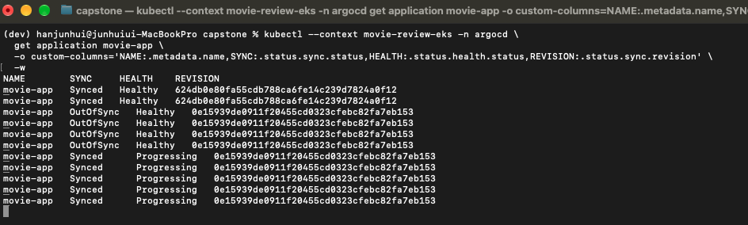
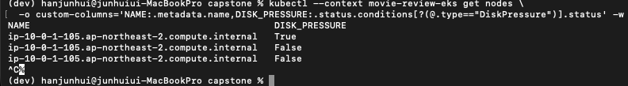

# EKS backend 배포 지연과 DiskPressure 대응

## 요약

단일 노드 EKS에서 GitOps로 backend 이미지를 갱신하던 중 rollout이 시간 초과되고 노드에서 `DiskPressure=True`가 관측되었다. 기존 이미지로 롤백한 뒤 서비스 상태를 확인했고, 이후 Linux 이미지에 포함된 GPU 의존성을 CPU 전용 PyTorch로 변경했다.

큰 이미지가 디스크 압박에 기여했을 가능성이 높다고 판단했다. 다만 장애 순간의 파일별 사용량과 eviction 이벤트를 확보하지 못했으므로, GPU 패키지를 유일한 원인으로 단정하지 않는다.

## 환경

| 항목 | 구성 |
| --- | --- |
| 실습 일시 | 2026-10-02 ~ 2026-10-03, KST |
| 클러스터 | 서울 리전 EKS, `movie-review-eks` |
| 워커 노드 | t3.large 1대, 루트 디스크 20 GiB |
| 앱 | FastAPI backend, Next.js frontend, PostgreSQL |
| 배포 | GitHub Actions → ECR → GitOps manifest 갱신 → Argo CD |
| backend 이미지 | sentence-transformers를 포함한 Python 이미지 |

## 1. 증상과 영향

backend rollout에서 다음 메시지가 발생했다.

```text
Waiting for deployment "backend" rollout to finish: 1 old replicas are pending termination...
error: timed out waiting for the condition
```

frontend rollout은 성공했지만 backend의 새 Pod 여러 개가 `ContainerStatusUnknown` 상태로 남았다. 기존 backend Pod는 `1/1 Running`으로 조회되었다. 당시 요청 성공률을 연속 측정하지 않았으므로 서비스 무중단을 입증한 것은 아니다.

Argo CD에서도 `Synced / Progressing`이 지속되었다. Git과 동기화된 상태만으로 새 앱이 정상 기동했다고 판단할 수 없었다.



노드 조회에서는 `DiskPressure=True`가 확인되었다. Pod 상태만으로 원인을 확정하지 않고 노드 디스크와 이미지 구성을 함께 조사했다.

## 2. 조사 결과

### 노드 디스크

kubelet stats summary를 조회했을 때 다음 값이 나왔다. 이 수치는 장애 최고점이 아니라 조사 시점의 값이다.

| 지표 | 값 |
| --- | ---: |
| node filesystem capacity | 19.93 GiB |
| node filesystem used | 12.71 GiB |
| node filesystem available | 7.22 GiB |
| image filesystem used | 9.45 GiB |
| image filesystem available | 7.22 GiB |

node filesystem과 image filesystem 수치는 같은 저장장치 사용량이 겹칠 수 있으므로 합산하지 않았다. 여유 공간이 확인된 시점에도 DiskPressure는 True였고, 이후 관측에서 False로 전환되었다. 당시 노드 Events 출력은 비어 있어 임계값 초과 시점과 세부 원인을 이벤트로 확정하지 못했다.

### 이미지와 의존성

ECR에서 이전 backend 이미지와 새 이미지의 크기를 확인했다.

| 이미지 | ECR imageSizeInBytes |
| --- | ---: |
| 기존 이미지 `230df5ad…` | 3,627,070,036 bytes |
| 갱신 이미지 `2f10d221…` | 3,626,045,472 bytes |

`uv.lock`에는 Linux용 PyTorch와 함께 NVIDIA CUDA 라이브러리 및 Triton이 포함되어 있었다. 이 실습의 t3.large 노드는 GPU를 사용하지 않으므로 해당 GPU 의존성은 실행 목적에 불필요했다.

20 GiB 디스크에서 큰 이미지의 다운로드·압축 해제와 이전 이미지 보관이 저장 공간 부담을 높였을 것으로 추정했다. ECR 크기는 노드에서 차지하는 압축 해제 후 크기와 같지 않으며, 이미지 레이어가 공유될 수 있어 이미지 크기를 단순 합산하지 않았다.

## 3. 우선 대응: 기존 이미지로 롤백

GitOps backend manifest를 이전 이미지 digest로 되돌렸다.

- 롤백 커밋: `ba54964` — Restore backend image after node disk exhaustion
- Argo CD에서 해당 revision의 `Synced / Healthy`를 확인했다.
- 이후 노드 관측에서 `DiskPressure=True → False` 전환을 확인했다.



디스크 압박 해제는 CPU 전용 이미지 배포 완료보다 먼저 확인했다. 따라서 이 캡처를 CPU 이미지 전환의 직접적인 결과로 설명하지 않는다. 이미지 정리 등 내부 동작을 당시 기록으로 추적하지 못했으므로, 여유 공간 회복의 정확한 메커니즘도 단정하지 않는다.

## 4. 후속 개선: CPU 전용 이미지

`pyproject.toml`에서 Linux용 torch를 CPU 전용 인덱스로 지정하고 `uv.lock`을 다시 생성했다.

```toml
[tool.uv.sources]
torch = [
    { index = "pytorch-cpu", marker = "sys_platform == 'linux'" },
]

[[tool.uv.index]]
name = "pytorch-cpu"
url = "https://download.pytorch.org/whl/cpu"
explicit = true
```

위 설정은 torch를 프로젝트 dependencies에 추가한 상태에서 사용했다. lock 갱신 결과 Linux용 CUDA·NVIDIA 패키지와 Triton이 제거되었다.

Dockerfile에서는 `uv sync --frozen --no-dev --no-cache`로 설치 캐시를 남기지 않도록 변경하고, 가상환경의 Playwright 실행 파일을 직접 사용했다. 브라우저 의존성 설치 후 apt 목록도 정리했다.

- 변경 커밋: [e05756c](https://github.com/httpJun/movie-review-devops/commit/e05756c497720da8b2d8085a5109ffddf2b2aa8e)
- 이미지 digest 반영 커밋: `3a85373` — Deploy images from e05756c…

소스 변경 커밋과 CI가 생성하는 배포 manifest 커밋이 서로 다르다는 점도 확인했다. 소스 커밋에서 Argo CD가 Healthy여도, 새 이미지 digest가 아직 반영되지 않았다면 기존 이미지가 실행될 수 있다.

## 5. 검증 결과

### 로컬 이미지

linux/amd64 이미지에서 직접 실행한 결과다.

```text
Local image size: 0.97 GiB
torch: 2.14.1+cpu
CUDA build: None
GPU packages: []
sentence-transformers import: OK
```

로컬 이미지 크기와 앞서 확인한 ECR 압축 이미지 크기는 측정 기준이 다르므로 두 수치로 감소율을 계산하지 않았다. import 성공은 실제 임베딩 생성이나 전체 분석 파이프라인 성공까지 의미하지 않는다.

### EKS 배포

CPU 이미지의 digest를 반영한 후 다음 결과를 확인했다.

- backend와 frontend rollout 성공
- Argo CD Application의 동기화 및 정상 상태 확인
- 실행 중 backend의 torch CPU 빌드 및 `torch.version.cuda = None` 확인
- 노드 `DiskPressure=False` 확인

CPU 전환 완료 화면의 캡처는 남기지 못했다. 이 항목은 당시 실행 확인 기록이며, 위 DiskPressure 캡처와 구분한다. 이후 생성된 최신 CI 이미지까지 이 검증 결과를 자동으로 적용하지 않는다.

## 6. 배운 점과 남은 개선

| 항목 | 이번에 확인한 점 | 후속 과제 |
| --- | --- | --- |
| 배포 상태 | Synced만으로 새 이미지 정상 기동을 판단할 수 없음 | revision·image digest·rollout·API 응답을 함께 확인 |
| 이미지 의존성 | GPU를 사용하지 않는 환경에도 GPU 패키지가 설치될 수 있음 | 대상 플랫폼 기준 의존성과 이미지 크기 점검 |
| 디스크 | 단일 노드의 제한된 디스크가 rollout을 막을 수 있음 | 디스크 용량·inode·이벤트를 배포 전후 수집 |
| 장애 대응 | 이전 이미지 digest를 보존하면 GitOps 롤백 가능 | 롤백 절차와 검증 항목 자동화 |
| 모니터링 | 사후 출력만으로 순간적인 자원 압박을 설명하기 어려움 | 디스크 사용량 추이 및 관련 경고 보강 |

디스크 증설이나 임계값 변경은 이번 해결 과정에서 수행한 것으로 기록하지 않는다. 실제 사용자 트래픽 영향, 고가용성, 노드 장애 복구 역시 별도 검증이 필요하다.

## 관련 기록

- [실습 캡처 및 검증 기록](verification.md)
- [EKS 실습 README](../k8s/eks-demo/README.md)
- [포트폴리오 개요](../README.md)
