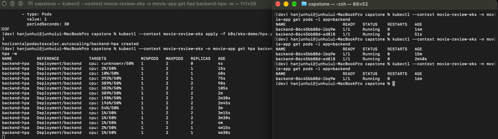
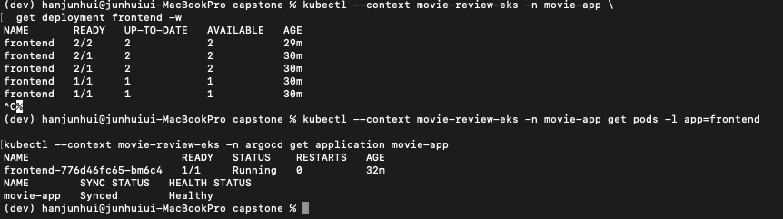
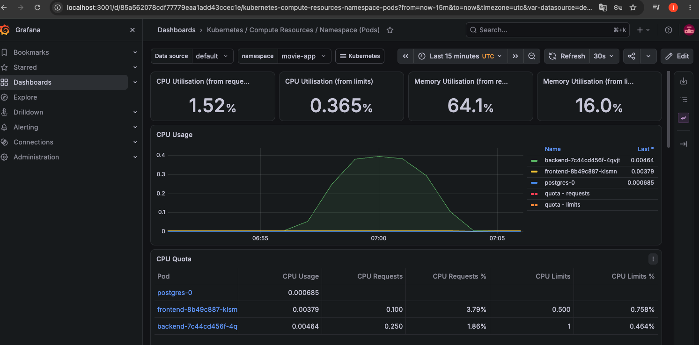
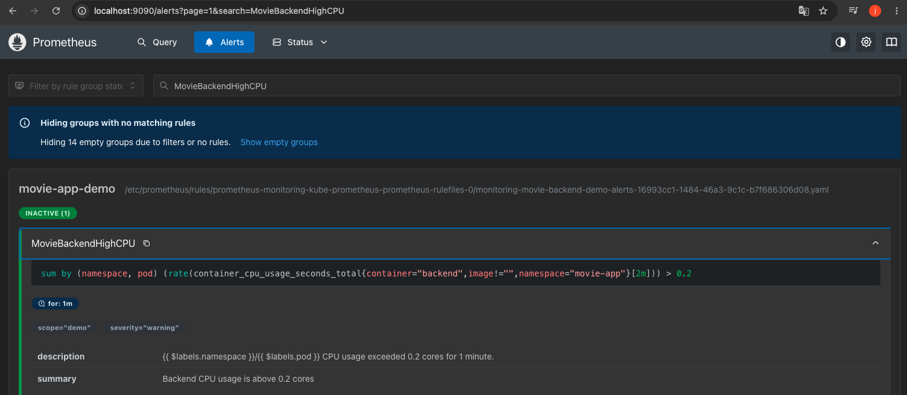
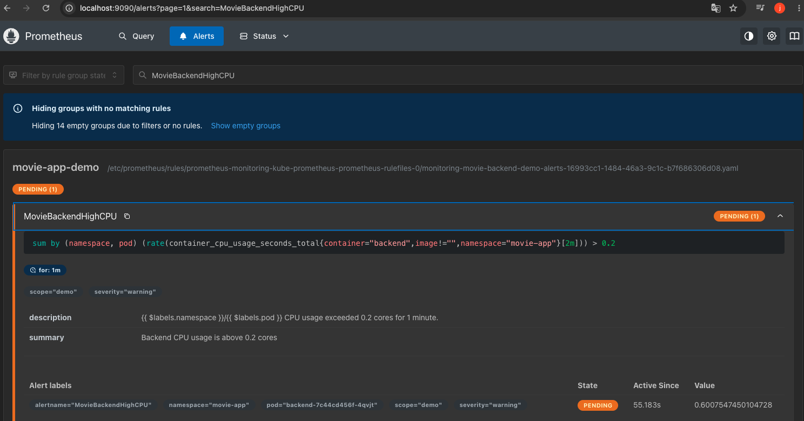
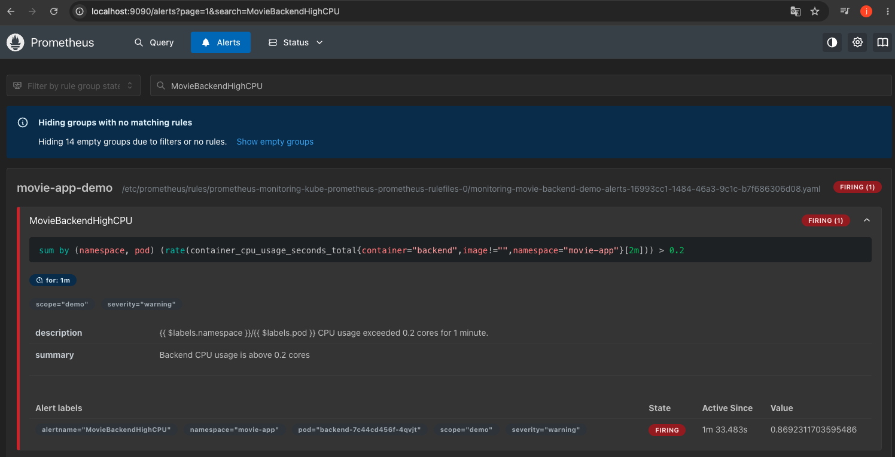
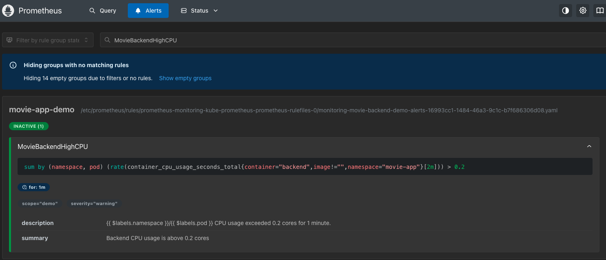

# EKS DevOps 실습 검증 기록

Terraform으로 구성한 단기 EKS 환경에서 배포, 자동 확장, 모니터링과 경고 규칙을 검증한 기록이다. 캡처는 서로 다른 실습 세션에서 확보했으며, 모든 구성요소를 동시에 운영했다는 의미는 아니다.

- 실습 기간: 2026-10-01 ~ 2026-10-04 (KST)
- 환경: 서울 리전, 단일 EKS 워커 노드, `movie-app` 네임스페이스
- 아래 이미지는 실제 실습 캡처 원본이며 파일명만 정리했다.
- 단기 실습 환경은 종료 후 삭제했다. 아래 화면은 현재 실행 상태가 아닌 당시 기록이다.

## 검증 항목

| 항목 | 캡처에서 확인한 내용 | 해석 범위 |
| --- | --- | --- |
| HPA | CPU 부하에 따라 backend Pod 1 → 2 → 1 | Pod 자동 확장·축소, 노드 자동 확장은 제외 |
| GitOps | frontend replica 2 → 1 및 Argo CD Synced / Healthy | GitOps replica 변경 결과 |
| CPU 모니터링 | backend CPU 상승 후 평상시 수준으로 하락 | 인위적 CPU 부하 관측 |
| 경고 규칙 | Inactive → Pending → Firing → Inactive | Prometheus 내부 평가, 외부 알림 제외 |
| 배포 지연 | Argo CD Synced / Progressing 지속 | 배포 완료 증거가 아닌 문제 상황 |
| 디스크 상태 | DiskPressure True → False | 해당 시점의 디스크 압박 상태 해제 |

## 1. HPA 자동 확장·축소 — 2026-10-01

backend HPA를 최소 1개, 최대 2개, 목표 CPU 사용률 50%로 설정하고 인위적인 CPU 부하를 발생시켰다. HPA 출력에서 replica가 1 → 2 → 1로 바뀌며, 실제 backend Pod 조회에서도 2개에서 1개로 감소한 것을 확인했다.

CPU 백분율은 컨테이너 CPU request 대비 사용률이다. 노드 전체 CPU 사용률과는 기준이 다르므로 100%를 초과할 수 있다.

이 검증은 실제 사용자 요청에 대한 처리 성능이나 노드 자동 확장을 입증하지 않는다.

## 2. GitOps replica 변경 — 2026-10-02

GitOps replica 변경 실습에서 frontend Deployment가 2개에서 1개로 축소되었다. 최종 Pod는 `1/1 Running`, Argo CD Application은 `Synced / Healthy` 상태로 확인했다.

이 화면은 GitOps replica 변경 결과를 보여준다. backend HPA 실습 및 CPU 전용 이미지 배포와는 별도의 검증이다.

## 3. Grafana CPU 부하 관측 — 2026-10-04

backend 컨테이너 내부에서 인위적인 CPU 부하를 발생시키고 Grafana에서 CPU 사용량을 관측했다. backend CPU는 약 0.4코어까지 상승한 뒤 부하 종료 후 평상시 수준으로 내려왔다.

이번 모니터링 세션에는 HPA와 Argo CD를 설치하지 않았다. CPU 그래프는 모니터링 동작 증거이며 HPA 동작이나 HTTP 요청 지연 시간 측정 결과는 아니다.

## 4. Prometheus 경고 발생·해제 — 2026-10-04

- 경고 이름: `MovieBackendHighCPU`
- 조건: backend 컨테이너의 최근 2분 평균 CPU 사용량이 0.2코어를 초과한 상태로 1분 유지
- 심각도: `warning`
- 부하: backend 컨테이너 내부에서 240초간 인위적인 CPU 부하 발생
- 규칙 파일: [backend-cpu-alert.yaml](../k8s/monitoring/backend-cpu-alert.yaml)

### 부하 전: Inactive

### 조건 충족 후 대기: Pending

임계값을 초과했지만 `for: 1m` 유지 시간이 아직 지나지 않은 상태다.

### 조건 유지: Firing

임계값 초과 상태가 설정한 시간 동안 유지되어 경고가 발생했다.

### 부하 종료 후: Inactive

부하 종료 후 CPU 사용량이 내려가면서 경고가 해제되었다. 2분 평균을 사용하므로 부하 종료 순간에 바로 해제되는 것은 아니다.

Alertmanager는 비활성화되어 있었다. 이메일·Slack 전송은 검증하지 않았으며, 위 화면은 Prometheus의 경고 조건 평가와 상태 전이를 보여준다.

## 5. 배포 지연과 디스크 상태 복구 — 2026-10-02 ~ 2026-10-03

### 배포 지연 기록

새 GitOps revision 반영 과정에서 `Synced / Progressing` 상태가 지속되었다. `Synced`는 Git의 선언과 동기화되었다는 의미이며, 이 화면만으로 앱의 정상 기동까지 완료되었다고 판단할 수 없다.

### 노드 디스크 압박 해제

노드 상태 관측에서 `DiskPressure=True`가 `False`로 바뀌는 것을 확인했다.

이 캡처 자체는 CPU 전용 이미지 전환 완료를 입증하지 않는다. CPU 전용 PyTorch 전환은 별도의 빌드·실행 확인 기록과 커밋으로 남겼다. 해당 단계의 캡처는 확보하지 않았다.

- CPU 전용 이미지 변경 커밋: [e05756c](https://github.com/httpJun/movie-review-devops/commit/e05756c497720da8b2d8085a5109ffddf2b2aa8e)
- 당시 로컬 확인: `torch.version.cuda = None`, GPU 관련 패키지 목록 `[]`, sentence-transformers import 성공
- 로컬 CPU 이미지 크기: 약 0.97 GiB. ECR 압축 이미지 크기와 측정 기준이 달라 직접적인 감소율 비교는 하지 않았다.

## 검증의 한계

- 단일 노드 실습이며 고가용성이나 노드 장애 시 무중단을 검증하지 않았다.
- 인위적인 CPU 부하를 사용했으며 실제 사용자 트래픽 성능 시험은 수행하지 않았다.
- PostgreSQL 및 모니터링 데이터는 임시 저장 구성을 사용했다. 데이터 영속성과 복구 검증은 별도 과제다.
- 캡처 당시 배포와 이후 CI에서 빌드한 최신 이미지는 다를 수 있다. 최신 digest의 실행 검증으로 확대 해석하지 않는다.
- 재배포 자동화 스크립트는 로컬 검사와 실제 클러스터 적용 검증을 구분해서 기록한다.

## 관련 문서

- [포트폴리오 개요](../README.md)
- [EKS 단기 실습 기록](../k8s/eks-demo/README.md)
- [모니터링 실습 기록](../k8s/monitoring/README.md)
- [재배포 스크립트 안내](../scripts/infra/README.md)

## 재배포 자동화 검증

[2026-10-05 재배포 자동화 검증](redeployment-verification.md)
